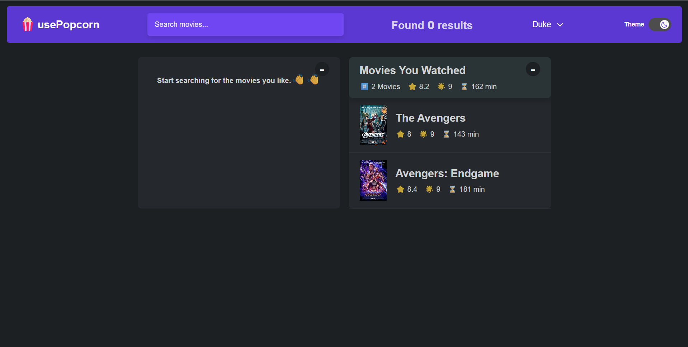
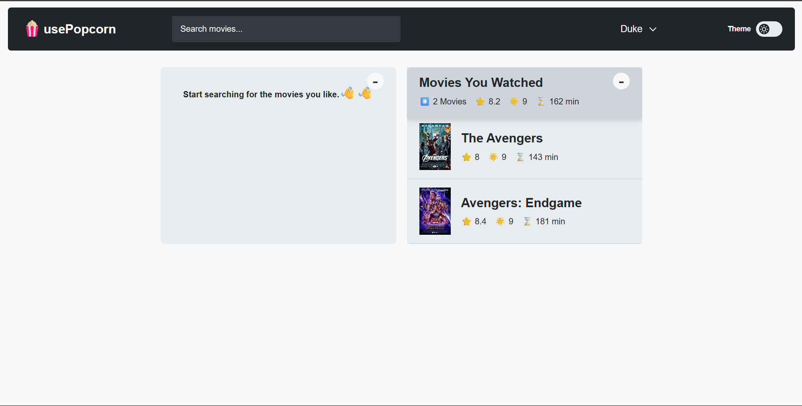
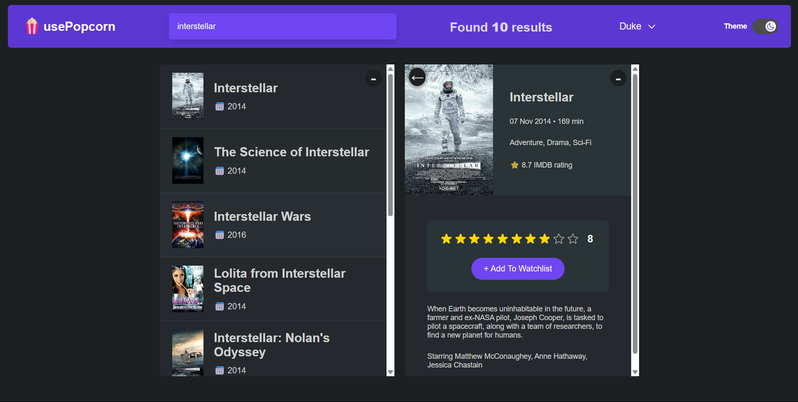
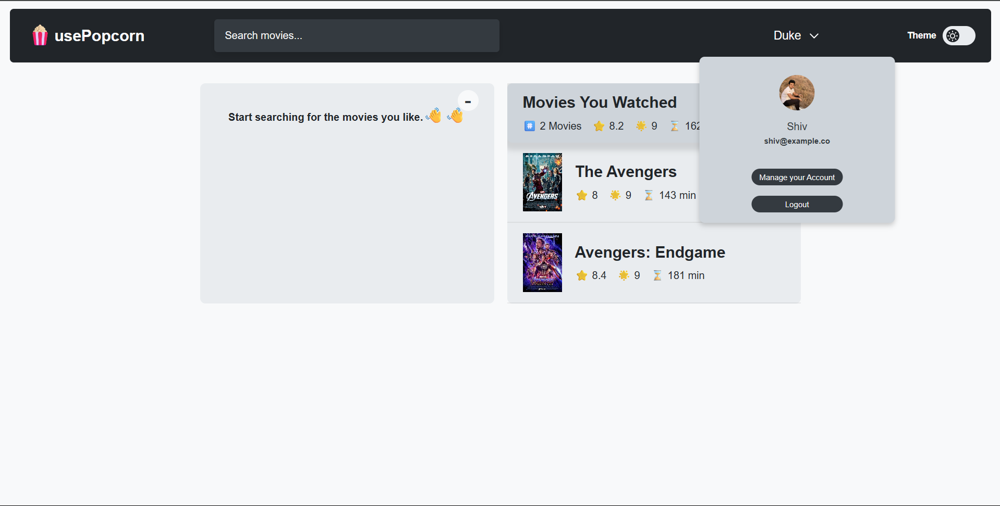
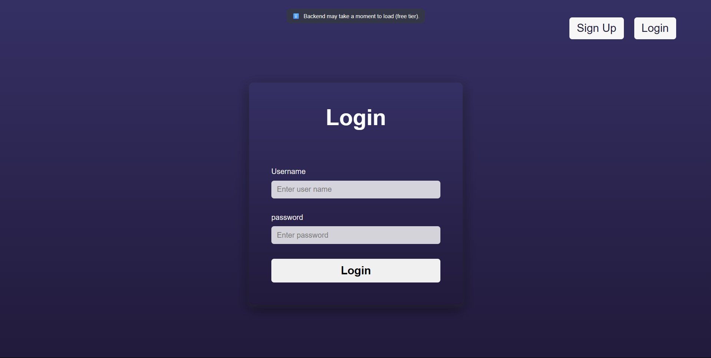

# usePopcorn - Your Personal Movie Watchlist & Discovery App

;

## Project Overview

`usePopcorn` is a dynamic and responsive web application built with React that allows users to search for movies, add them to a personal watchlist, rate watched movies, and discover details about films. This project showcases a strong understanding of modern frontend development practices, API integration, state management, and user authentication, making it an ideal demonstration for an entry-level web developer portfolio.

## Features

- **Movie Search:** Efficiently search for movies using the OMDB API.
- **Personal Watchlist:** Add movies to a personalized watchlist.
- **Movie Details:** View comprehensive details for selected movies, including plot, cast, director, and IMDb rating.
- **User Rating System:** Rate movies you've watched and see your average ratings.
- **User Authentication:** Secure user registration and login powered by a custom backend (`popcorn-backend`).
- **Responsive Design:** A seamless user experience across various devices (desktops, tablets, and mobile phones).
- **Interactive UI:** Smooth animations and transitions powered by `framer-motion` for an engaging user interface.
- **Dark/Light Theme Toggle:** Customize your viewing experience with a theme switcher.
- **Global State Management:** Efficient state management using React's Context API.

## Technologies Used

- **Frontend:**
  - React.js (with Vite for fast development)
  - JavaScript (ES6+)
  - CSS Modules (for scoped styling)
  - `framer-motion` (for animations)
- **Backend:**
  - Custom `popcorn-backend` (Node.js,Express.js, mongoose )
- **Database:**
  - MongoDB
- **API:**
  - OMDB API (for fetching movie data)
- **Tools & Linters:**
  - ESLint (for code quality and consistency)
  - Git (for version control)
  - npm (for package management)

## Usage

1.  **Register/Login:** Upon first visit, you'll be directed to the authentication page. Create a new account or log in with existing credentials.
    - _Note: The backend may take a moment to load as it's hosted on a free tier service._
2.  **Search for Movies:** Use the search bar in the navigation to find movies.
3.  **View Details & Rate:** Click on a movie from the search results to view its details. If you've watched it, you can rate it using the star rating component.
4.  **Manage Watchlist:** Add movies to your watchlist and track your watched movies.

## Screenshots / Demo

Here are some screenshots demonstrating the application's features and responsive design.

### Desktop View

_A clear view of the main application (dark mode) interface on a desktop._

_A clear view of the main application (light mode) interface on a desktop._

_A clear view of the movie details page._

_A clear view of the user dashboard._

_The application at login page._

## Future Enhancements (Optional)

- Implement more advanced search filters (genre, year, etc.).
- Integrate a recommendation engine.
- Improve accessibility features.
- Write comprehensive unit and integration tests.

---

